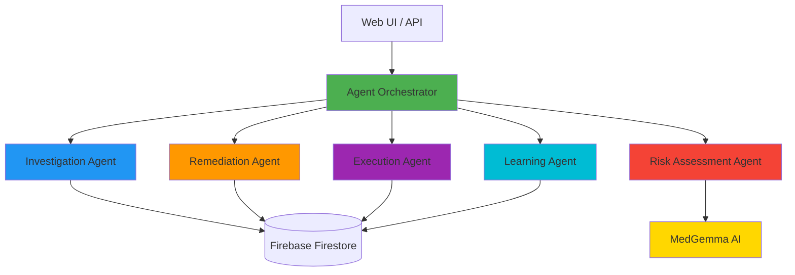
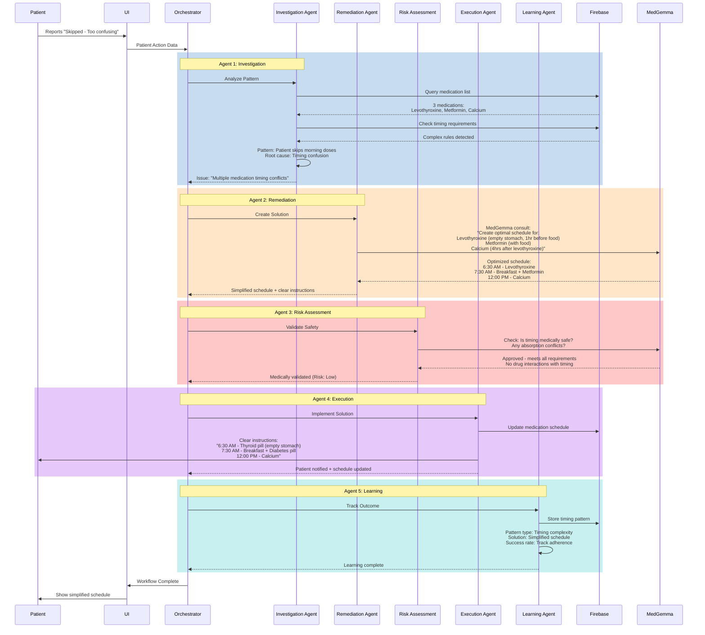
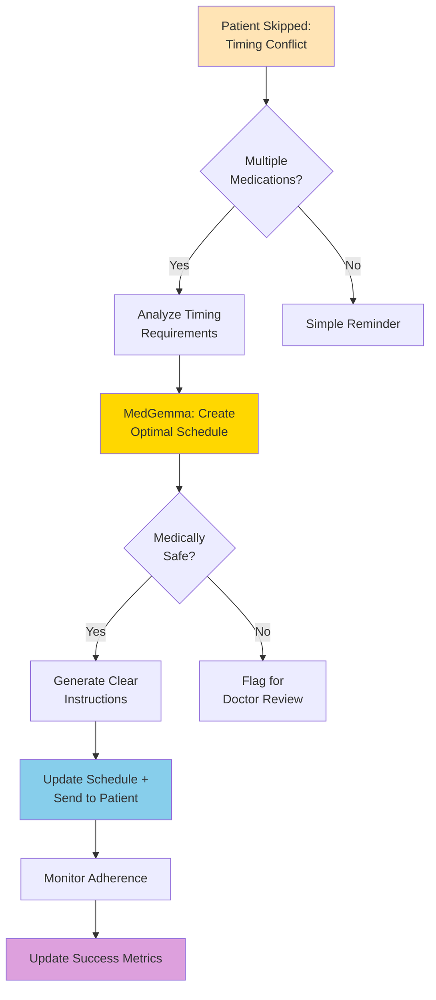
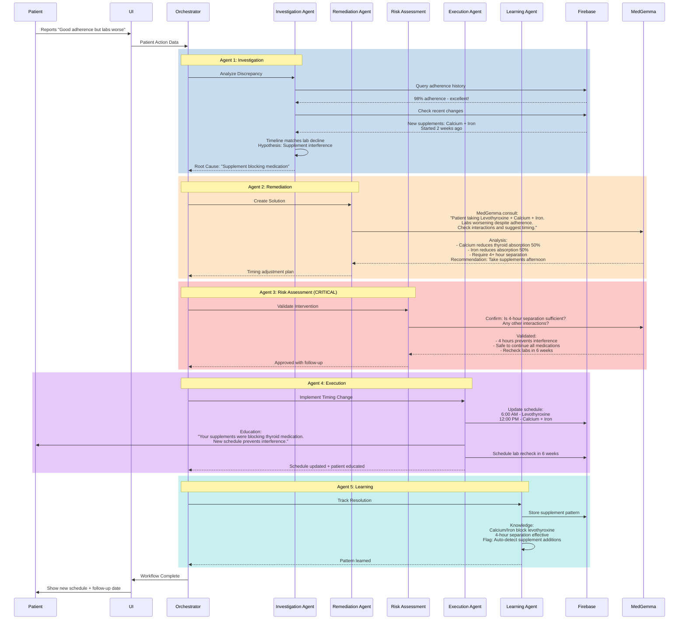
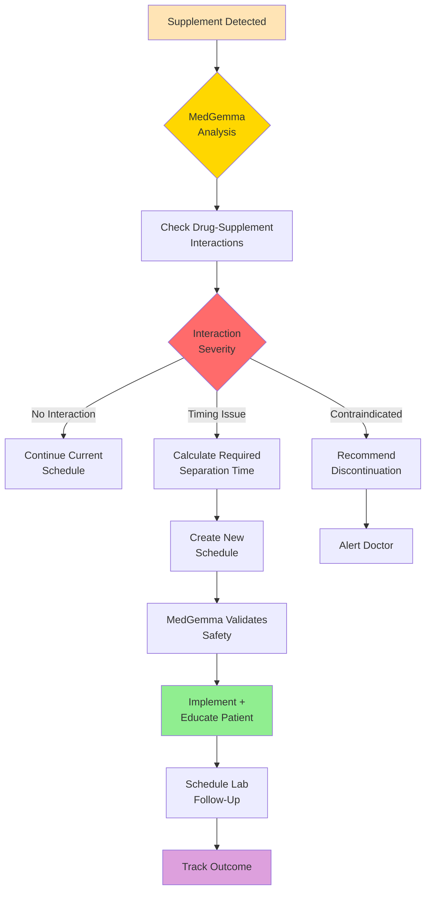
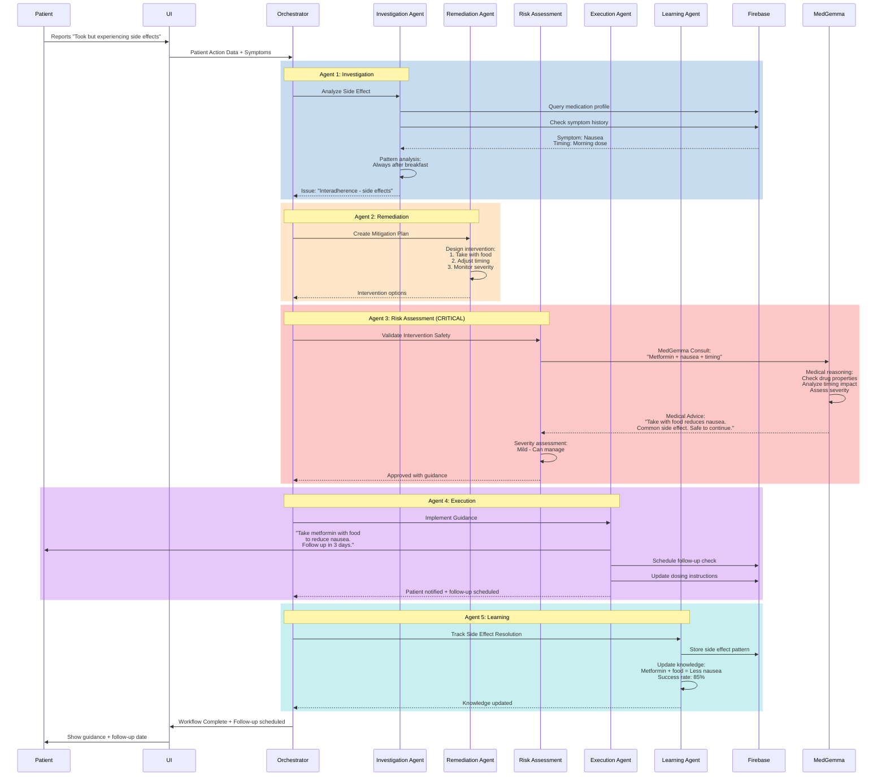
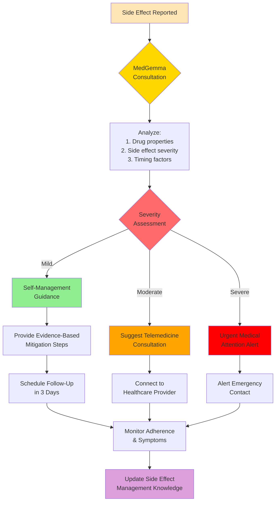
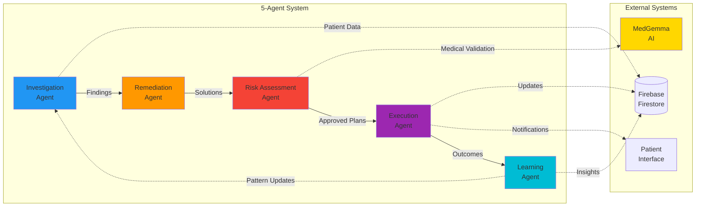

# Agentic Workflow Diagrams

This document illustrates the multi-agent workflows for different medication adherence scenarios.

## System Architecture

---

## Scenario 1: Medication Timing Conflict

**Trigger:** `action="skipped"`, `reason="timing_conflict"`

### Patient Problem
Patient has multiple medications with complex timing requirements (empty stomach, with food, 4 hours apart). Patient skips doses due to confusion about when to take each medication.

### Workflow Flow

### Decision Points

---

## Scenario 2: Supplement Interference

**Trigger:** `action="skipped"`, `reason="supplement_interference"`

### Patient Problem
Patient has excellent adherence (98%) but lab results are worsening. Recently started taking calcium and iron supplements that are blocking thyroid medication absorption by 50%.

### Workflow Flow

### MedGemma Decision Flow

---

## Scenario 3: Patient Experiencing Side Effects

**Trigger:** `action="took"`, `reason="side_effects"`

### Workflow Flow

### MedGemma Decision Flow

---

## Agent Interaction Matrix

---

## Key Differences Across Scenarios

| Aspect | Scenario 1: Timing Conflict | Scenario 2: Supplement Interference | Scenario 3: Side Effects |
|--------|---------------------------|-----------------------------------|--------------------------|
| **Trigger** | Skipped/Timing Conflict | Skipped/Supplement Interference | Took/Side Effects |
| **Investigation Focus** | Medication timing complexity | Drug-supplement interactions | Medical symptoms |
| **Remediation Type** | Optimized schedule | Timing separation | Dosing guidance |
| **Risk Level** | Low | Medium | Variable (Mild-Severe) |
| **MedGemma Role** | **Critical** | **Critical** | **Critical** |
| **Urgency** | Standard | Medium | Immediate |
| **Follow-Up** | Track adherence improvement | Lab recheck in 6 weeks | Symptom check in 3 days |
| **Learning Focus** | Timing complexity patterns | Supplement interference patterns | Side effect management |
| **Adherence Barrier** | "Too confusing to take" | "Taking it but not working" | "Can't tolerate it" |

---

## How to Use These Diagrams

### Viewing in VS Code
- Open this file and press `Ctrl+Shift+V` (or `Cmd+Shift+V` on Mac) to see the rendered diagrams
- The Mermaid extension will render all diagrams automatically

### Viewing on GitHub
- All Mermaid diagrams render automatically when you view this file on GitHub

### Creating Custom Diagrams with Draw.io
1. Create a new file with `.drawio` extension (e.g., `custom_flow.drawio`)
2. VS Code will open the Draw.io editor
3. Design your diagram visually
4. Save and commit to repository

### Editing These Diagrams
- Mermaid diagrams are text-based - just edit the code blocks
- See [Mermaid documentation](https://mermaid.js.org/) for syntax reference
